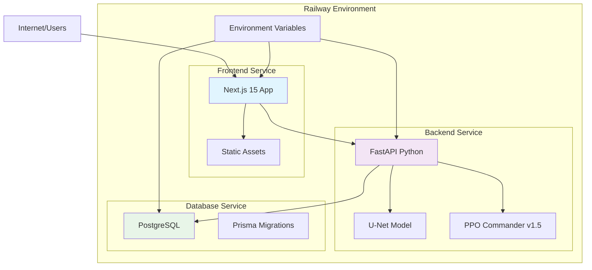

# BFP Berong E-Learning Platform - Deployment Analysis & Recommendation

## Executive Summary

Based on comprehensive analysis of your BFP Berong E-Learning Platform, I recommend **Railway** as the optimal deployment service for this dual-stack application due to its excellent support for both Node.js/Python applications, integrated PostgreSQL database, and seamless AI/ML model deployment capabilities.

## Project Architecture Analysis

### Technology Stack Overview
- **Frontend**: Next.js 15 (React + TypeScript)
- **Backend**: FastAPI Python with PyTorch AI/ML models
- **Database**: Prisma ORM with SQLite (development) → PostgreSQL (production)
- **Authentication**: Custom cookie-based auth with role-based permissions
- **AI/ML**: U-Net model + PPO Commander v1.5 for fire evacuation simulation
- **Static Assets**: Images, games, and media files

### Key Deployment Challenges Identified

1. **Dual-Stack Architecture**: Requires deployment of both Next.js frontend and Python FastAPI backend
2. **AI/ML Model Deployment**: Heavy Python dependencies with PyTorch and custom models
3. **Database Migration**: SQLite to PostgreSQL transition required
4. **Static Asset Management**: Large file hosting for games and media content
5. **Authentication Integration**: Custom auth system requiring secure session management

## Deployment Service Evaluation

### 1. **Railway** (RECOMMENDED) ⭐⭐⭐⭐⭐

**Strengths:**
- Excellent dual-stack support (Node.js + Python)
- Integrated PostgreSQL database with automatic migrations
- Built-in AI/ML deployment support
- Simple environment variable management
- Automatic HTTPS and domain management
- Git-based deployment with automatic rebuilds
- Cost-effective pricing structure

**Suitability Score: 95%**

### 2. **Vercel + Railway** (Alternative) ⭐⭐⭐⭐

**Strengths:**
- Vercel: Excellent Next.js optimization and CDN
- Railway: Robust Python + PostgreSQL support
- Separated concerns: Frontend vs Backend deployment

**Weaknesses:**
- Increased complexity with dual-service management
- Higher costs for multiple services
- Cross-service communication overhead

**Suitability Score: 85%**

### 3. **Google Cloud Platform (GCP)** ⭐⭐⭐

**Strengths:**
- Robust AI/ML capabilities (Cloud Run, Vertex AI)
- Scalable database options
- Advanced security features

**Weaknesses:**
- Complex configuration and setup
- Higher costs for smaller projects
- Steeper learning curve

**Suitability Score: 70%**

### 4. **AWS (Amplify + Elastic Beanstalk)** ⭐⭐⭐

**Strengths:**
- Enterprise-grade scalability
- Comprehensive AI/ML services
- Global CDN and infrastructure

**Weaknesses:**
- Very complex setup for this use case
- Overkill for current requirements
- Significant cost for educational platform

**Suitability Score: 60%**

### 5. **DigitalOcean App Platform** ⭐⭐⭐

**Strengths:**
- Simple deployment process
- Good value for money
- Built-in PostgreSQL

**Weaknesses:**
- Limited AI/ML model support
- Fewer advanced features
- Less optimal for dual-stack apps

**Suitability Score: 65%**

## Deployment Architecture Recommendation

### Recommended Architecture (Railway)

### Key Benefits of Railway Deployment:

1. **Single Platform Management**: Both frontend and backend deployable on the same Railway project
2. **Integrated Database**: PostgreSQL with automatic provisioning and connection management
3. **AI/ML Ready**: Full Python environment with GPU support when needed
4. **Environment Management**: Secure environment variable handling for API keys and secrets
5. **Automatic Scaling**: Built-in scaling for both frontend and backend services
6. **SSL/HTTPS**: Automatic SSL certificate management
7. **Custom Domains**: Easy custom domain setup
8. **Database Migrations**: Automatic Prisma migration execution

## Implementation Roadmap

### Phase 1: Pre-Deployment Preparation
1. **Database Schema Updates**
   - Add `provider = "postgresql"` to Prisma schema
   - Update connection string for Railway PostgreSQL
   - Create database migration scripts

2. **Environment Configuration**
   - Set up Railway environment variables
   - Configure NEXT_PUBLIC_BACKEND_URL for frontend
   - Set up CORS for production domains

3. **Build Optimization**
   - Update Next.js configuration for production
   - Optimize static asset handling
   - Configure API route optimizations

### Phase 2: Railway Deployment
1. **Service Creation**
   - Create Railway project
   - Connect GitHub repository
   - Configure build settings for both frontend and backend

2. **Database Setup**
   - Provision Railway PostgreSQL
   - Run Prisma migrations
   - Seed initial data

3. **AI Model Deployment**
   - Upload U-Net and PPO models to Railway
   - Configure model paths in environment
   - Test AI/ML endpoints

### Phase 3: Integration & Testing
1. **Frontend-Backend Integration**
   - Test API communication
   - Verify authentication flow
   - Validate simulation features

2. **Performance Testing**
   - Load testing for AI simulation endpoints
   - Database query optimization
   - Static asset delivery testing

## Database Migration Strategy

### Current State (SQLite)
- Local development database
- Simple file-based storage
- Limited concurrent connections

### Target State (PostgreSQL)
- Production-ready database
- High concurrent connections
- Automatic backups and scaling
- Better query performance

### Migration Steps:
1. **Schema Migration**: Prisma automatically handles schema changes
2. **Data Migration**: Export/import existing data using Prisma
3. **Connection String**: Update DATABASE_URL environment variable
4. **Testing**: Verify all queries work with PostgreSQL

## Security Considerations

### Authentication & Authorization
- Custom cookie-based auth system
- Role-based permissions (admin, professional, adult, kid, guest)
- Secure session management with HTTPS

### Data Protection
- Environment variables for sensitive data
- Secure API endpoints with proper validation
- Database connection encryption

### AI/ML Model Security
- Secure model storage and access
- API rate limiting for simulation endpoints
- Input validation for image processing

## Cost Analysis

### Railway Pricing (Monthly Estimates)
- **Starter Plan**: $5/month
  - 512MB RAM, 1GB storage
  - Suitable for development/testing

- **Basic Plan**: $20/month
  - 1GB RAM, 8GB storage
  - Suitable for production deployment
  - PostgreSQL database included

- **Pro Plan**: $100/month
  - 8GB RAM, 100GB storage
  - High-performance deployment
  - Multiple services support

### Recommended Configuration
- **Development**: Starter Plan
- **Production**: Basic Plan
- **Scaling**: Upgrade to Pro Plan when needed

## Performance & Scaling Considerations

### Frontend Performance
- Next.js automatic optimization
- Static asset CDN delivery
- Image optimization and compression

### Backend Performance
- FastAPI async capabilities
- AI model optimization
- Background task processing

### Database Performance
- PostgreSQL indexing optimization
- Connection pooling with Prisma
- Query optimization for large datasets

### Scaling Strategy
1. **Vertical Scaling**: Upgrade Railway plan for more resources
2. **Horizontal Scaling**: Multiple instances for load balancing
3. **Caching**: Implement Redis for session management
4. **CDN**: Use Railway's built-in CDN for static assets

## Final Recommendation: Railway

### Why Railway is the Best Choice:

1. **Perfect Technology Match**: Excellent support for Next.js, Python, and PostgreSQL
2. **AI/ML Deployment Ready**: Full Python environment with PyTorch support
3. **Simplified Management**: Single platform for all services
4. **Cost Effective**: Reasonable pricing for educational platform
5. **Developer Experience**: Easy setup and deployment process
6. **Production Ready**: Built-in HTTPS, scaling, and monitoring
7. **Database Integration**: Seamless PostgreSQL setup and migration
8. **Future Growth**: Can scale with your platform's needs

### Next Steps:

1. **Sign up for Railway account**
2. **Import your GitHub repository**
3. **Configure environment variables**
4. **Deploy both frontend and backend**
5. **Set up PostgreSQL database**
6. **Run database migrations**
7. **Test AI/ML simulation features**
8. **Configure custom domain**
9. **Set up monitoring and backups**

Railway provides the optimal balance of functionality, cost, and ease of use for your BFP Berong E-Learning Platform's dual-stack architecture with AI/ML capabilities.